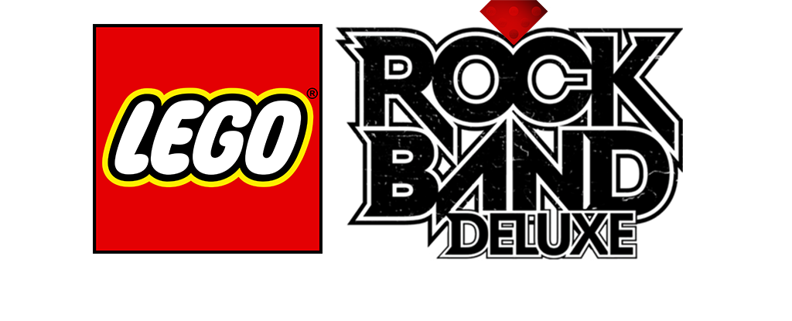

# LEGO-Rock-Band-Deluxe

## Introduction

This Repo contains everything you need to build an ark for LEGO Rock Band Deluxe for PS3 or Xbox 360.

## Features

### Quality of Life
* No strum limit executable modification
* Fast start executable modification
* Additional intro skip scripting to skip the intro movie
* No family friendly rating check
* Full Combo indicator per instrument via the multiplier (only shows up after the first note is hit)
* Bass streak effect from RB3/RB4 available on all instruments
* All NPCs and licensed musicians usable in quickplay
* Selectable song speed and track speed by 5% increments
* Selectable venue framerate up to 60fps
* Manual calibration adjusts by 1ms instad of 5ms

### Additional Modifications
* Random hue for splash screen and main menu text
* Nice (69%) and Awesome Choke (98-99%) callouts on solo completion
* New main menu music pulled from other Rock Band titles

## Install

**NOTE: You WILL need a modded/hacked console to play this mod on console. I hope this is clear
**NOTE: Lego Rock Band Deluxe only works with USA (`BLUS30382`) copies of the game on PS3.
**NOTE: DO NOT OVERWRITE THE FILES ON YOUR DISC!

Setting up the LEGO Rock Band Deluxe repo for the first time is meant to be as easy as possible.
As well, it is designed to allow you to automatically receive updates as the repo is updated.

Simply go to the Releases of this repo and grab all three files. (two .exe, one .bat, .sh for linux)

The two exe's are a couple dependencies, [Git for Windows](https://gitforwindows.org/), and [Dot Net 6.0 Runtime](https://dotnet.microsoft.com/en-us/download/dotnet/6.0/runtime).
Git is required for you to take advantage of auto updating via github pulls. Dot Net is required to build an ARK file, the archive format the game needs to run.
You can setup git with all default options, same with dot net.

Once the dependencies are installed, run "_init_repo.bat" in an **empty folder**. git will pull the repo and make sure you are completely up to date.

From then on simply run "_build_ps3.bat" or "_build_xbox.bat", depending on the platform you are building for. This script will pull the repo again for updates, and build the ARK for you and spit it out in _build/Xbox or _build/PS3

On ps3/rpcs3, first update your game to the latest patch, then copy all files in "_build/ps3/" to "/dev_hdd0/game/BLUS30382/"
Match the file system and overwrite the files.

On Xbox, copy the gen folder and the xex from "_build/xbox/" to the location you have installed LEGO Rock Band.

Make sure you clear your song cache, as well as your system cache.

To clear song cache, navigate to Storage>LEGO Rock Band> and delete the song cache.

To clear system cache, navigate to Storage, and press Y to clear the system cache.

If installing for the first time, make sure you rename the vanilla "default.xex" to "default_vanilla.xex" for safety.

Run the build script again to pull any new updates committed to the repo and rebuild a new ark.

## Included Dependencies

[Git for Windows](https://gitforwindows.org/) - CLI application to allow auto updating repo files

[Dot Net 6.0 Runtime](https://dotnet.microsoft.com/en-us/download/dotnet/6.0/runtime) - Needed to run ArkHelper

[Mackiloha](https://github.com/PikminGuts92/Mackiloha) - ArkHelper for building LEGO Rock Band ARK - Superfreq for building .bmp_xbox highway images

[dtab](https://github.com/mtolly/dtab) - For serializing Rock Band dtb files
